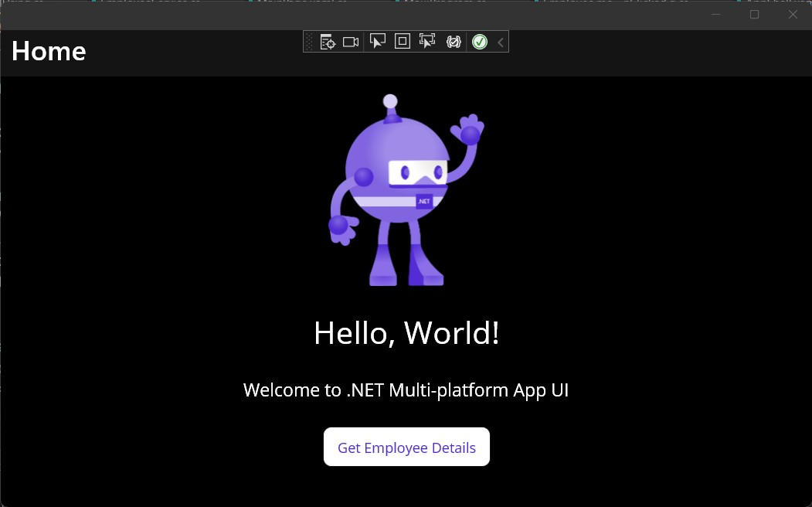
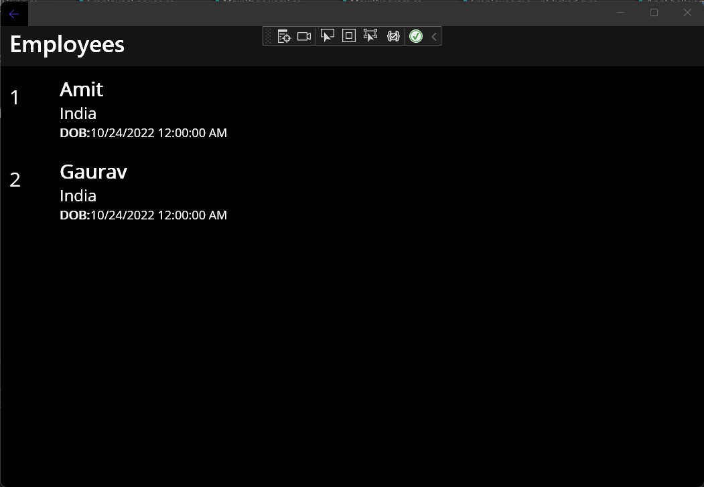
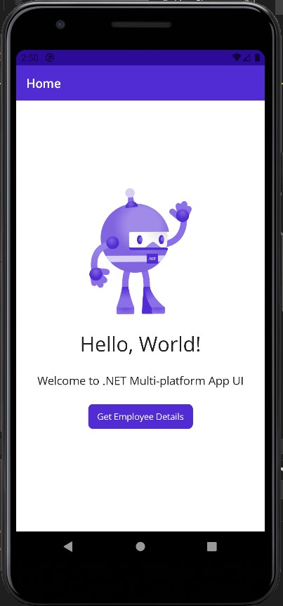
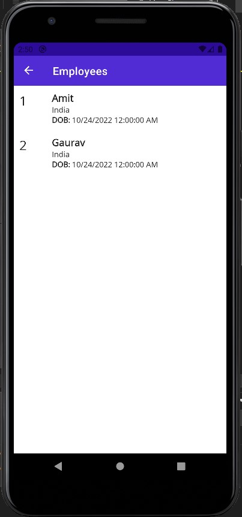

# [Employee.me](https://github.com/behl1anmol/Employee.me)
Employee.me is an app to fetch Employee data from a SQL Database by consuming a .NET 6 Web API.

### Platforms

- [x] Android
- [x] Windows

## Features
* Using MS SQL 
* Consuming .NET 6 Web API
* ColletionView
* Activity Indicator
* MVVM

## Preview

### Windows
 &nbsp;&nbsp;&nbsp; 
 &nbsp;&nbsp;&nbsp;

### Android
 &nbsp;&nbsp;&nbsp; 
 &nbsp;&nbsp;&nbsp; 

## More information
- Author: [Anmol Behl](https://github.com/behl1anmol)
- Source code: [https://github.com/behl1anmol/Employee.me](https://github.com/behl1anmol/Employee.me)
- Future planned features:
	* Integrating all the endpoints from the API